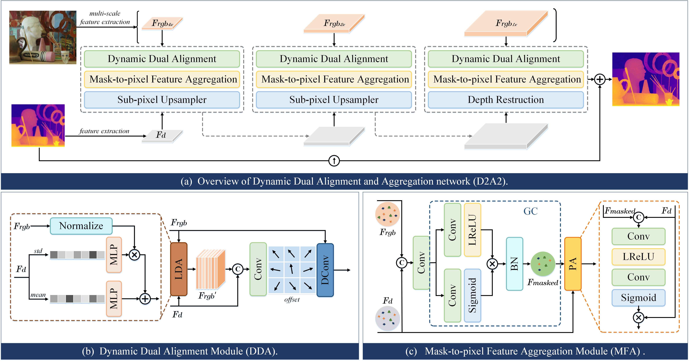

<p align="center">
<h2 align="center"> The Devil is in the Details: Boosting Guided Depth Super-Resolution via Rethinking Cross-Modal Alignment and Aggregation </h2>

<p align="center">
    Xin-Ni Jiang<sup>#</sup>, Zeng-Sheng Kuang<sup>#</sup>, Chun-Le Guo<sup>*</sup>, Rui-Xun Zhang, Lei Cai, Xiao Fan, Chong-Yi Li<sup>*</sup>
</p>

<p align="center">
[<a href="https://arxiv.org/abs/2401.08123"><strong>Paper</strong></a>]
[<a href="https://JiangXinni.github.io/projects/D2A2/index.html"><strong>Project Page</strong></a>]
</p>



Guided depth super-resolution (GDSR) involves restoring missing depth details using the high-resolution RGB image of the same scene. Previous approaches have struggled with the heterogeneity and complementarity of the multi-modal inputs, and neglected the issues of modal misalignment, geometrical misalignment, and feature selection. In this study, we rethink some essential components in GDSR networks and propose a simple yet effective Dynamic Dual Alignment and Aggregation network (D2A2). D2A2 mainly consists of 1) a dynamic dual alignment module that adapts to alleviate the modal misalignment via a learnable domain alignment block and geometrically align cross-modal features by learning the offset; and 2) a mask-to-pixel feature aggregate module that uses the gated mechanism and pixel attention to filter out irrelevant texture noise from RGB features and combine the useful features with depth features. By combining the strengths of RGB and depth features while minimizing disturbance introduced by the RGB image, our method with simple reuse and redesign of basic components achieves state-of-the-art performance on multiple benchmark datasets.

## Setup

#### Dependencies
The conda environment with all required dependencies can be generated by running
```bash
conda env create -f environment.yml
conda activate GDSR-D2A2
cd models/Deformable_Convolution_V2
sh make.sh
```

#### Datasets
The [NYUv2](https://cs.nyu.edu/~silberman/datasets/nyu_depth_v2.html) dataset can be downloaded [here](https://drive.google.com/file/d/1ZWpiVkog5aDBzVi2dCjGGSdiVqrLNTjR/view?usp=sharing). 
Your folder structure should look like this:
```
NYUv2
└───Depth
│   │   0.npy
│   │   1.npy
│   │   2.npy
│   │   ...
│   │   1448.npy 
└───RGB
│   │   0.jpg
│   │   1.jpg
│   │   2.jpg
│   │   ...
│   │   1448.jpg
```

Lu, Middlebury and RGBDD datasets are only used for testing and can be downloaded [here](https://drive.google.com/file/d/1EKkk0ZRjbbf_ajh5KUrjw0TTq8G19bZ8/view?usp=sharing).

#### Pretrained Model
Our pretrained model checkpoints are available in ``'./pretrained/D2A2_x4'``, ``'./pretrained/D2A2_x8'`` and ``'./pretrained/D2A2_x16'``. 

## Training

Please modify the ``'--dataset_dir'`` in file ``'train.sh'``. More options are available in file ``'option.py'``. 
```bash
sh train.sh
```

## Testing

Please modify the ``'--dataset_dir'`` in file ``'test.sh'``. More options are available in file ``'option.py'``. 
```bash
sh test.sh
```

## Citation

```
@article{jiang2024the,
        title={The Devil is in the Details: Boosting Guided Depth Super-Resolution via Rethinking Cross-Modal Alignment and Aggregation},
        author={Jiang, Xinni and Kuang, Zengsheng and Guo, Chunle and Zhang, Ruixun and Lei Cai and Xiao Fan and Li, Chongyi},
        journal={arXiv preprint arXiv:2401.08123},
        year={2024}
}
```
