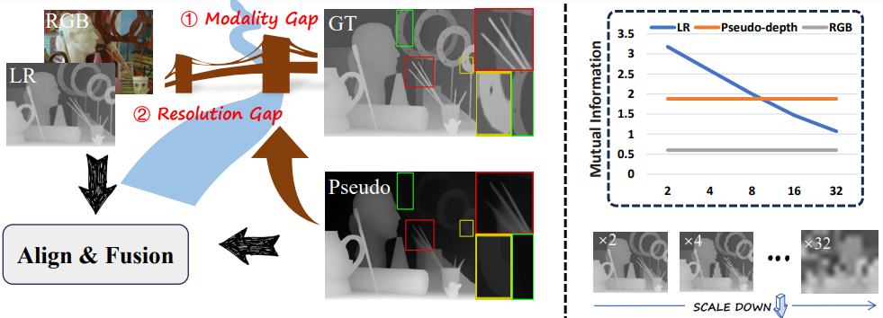

<p align="center">
<h2 align="center"> Boosting Guided Depth Super-Resolution Through Large Depth Estimation
Model and Alignment-then-Fusion Strategy </h2>

<p align="center">
  > Yuan-lin Zhang <sup>#</sup>,Xin-Ni Jiang<sup>#</sup>,Chun-Le Guo<sup>*</sup>,  Xiong-Xin Tang<sup>*</sup>, Guo-Qing Wang, Wei Li, Xun Liu,Chong-Yi Li
</p>
<p align="center">
[<a href="https://arxiv.org/abs/2401.08123"><strong>Paper</strong></a>]
[<a href="https://JiangXinni.github.io/projects/D2A2/index.html"><strong>Project Page</strong></a>]
</p>



Guided Depth Super-Resolution (GDSR) presents two primary challenges: the resolution gap between Low-Resolution
(LR) depth maps and High-Resolution (HR) RGB images,
and the modality gap between depth and RGB data. In this
study, we leverage the powerful zero-shot capabilities of large
pre-trained monocular depth estimation models to address
these issues. Specifically, we utilize the output of monocular depth estimation as pseudo-depth to mitigate both gaps.
The pseudo-depth map is aligned with the resolution of the
RGB image, offering more detailed boundary information
than the LR depth map, particularly at larger scales. Furthermore, pseudo-depth provides valuable relative positional
information about objects, serving as a critical scene prior
to enhance edge alignment and reduce texture overtransfer.
However, effectively bridging the cross-modal differences
between the guidance inputs (RGB and pseudo-depth) and
LR depth remains a significant challenge. To tackle this,
we analyze the modality gap from three key perspectives:
distribution misalignment, geometrical misalignment, and
texture inconsistency. Based on these insights, we propose
an alignment-then-fusion strategy, introducing a novel and
efficient Dynamic Dual-Aligned and Aggregation Network
(D2A2). By leveraging large pre-trained monocular depth
estimation models, our approach achieves state-of-the-art
performance on multiple benchmark datasets, excelling particularly in the challenging ×16 GDSR task. 
## Setup

### Dependencies
The conda environment with all required dependencies can be generated by running
```bash
conda env create -f environment.yml
conda activate GDSR-D2A2
cd models/Deformable_Convolution_V2
sh make.sh
```
### Datasets
The [NYUv2](https://cs.nyu.edu/~silberman/datasets/nyu_depth_v2.html) dataset can be downloaded [here](https://drive.google.com/file/d/1ZWpiVkog5aDBzVi2dCjGGSdiVqrLNTjR/view?usp=sharing). 
Your folder structure should look like this:
```
NYUv2
└───Depth
│   │   0.npy
│   │   1.npy
│   │   2.npy
│   │   ...
│   │   1448.npy 
└───RGB
│   │   0.jpg
│   │   1.jpg
│   │   2.jpg
│   │   ...
│   │   1448.jpg
└───MDE_relative
│   │   0.png
│   │   1.png
│   │   2.png
│   │   ...
│   │   1448.png
```

Lu, Middlebury and RGBDD datasets are only used for testing and can be downloaded [here](https://drive.google.com/file/d/1EKkk0ZRjbbf_ajh5KUrjw0TTq8G19bZ8/view?usp=sharing).

The pseudo lable is obtained from [Depth-Anything-V2](https://github.com/DepthAnything/Depth-Anything-V2?tab=readme-ov-file),
use the model checkpoint [Depth-Anything-V2-Large](https://huggingface.co/depth-anything/Depth-Anything-V2-Large/resolve/main/depth_anything_v2_vitl.pth?download=true)
, or you can directly download  the monocular depth estimate results from [[Google Drive]](https://drive.google.com/file/d/1ov3xFFn9T99IJxB7xLqHalk5IulKwVWb/view?usp=sharing), [[Baidu Cloud]](https://pan.baidu.com/s/12Mx9mStYrOtQFJCcLhBg2g?pwd=qp55).

### Pretrained Model
Download pretrained models from [[Google Drive]](https://drive.google.com/file/d/10LMiWLkrBUqgVE2F52rkWAwMjoQmyfpl/view?usp=sharing), 
[[Baidu Cloud]](https://pan.baidu.com/s/1F2_e8AKvVglvUgEh2FsoXw?pwd=ujgm)
and put them in the pretrained folder.
## Training

Please modify the ``'--scale'``,``'--dataset_dir'`` in file ``'option.py'``. 
   ```bash
   python train_d2a2.py  
   ```

## Testing

1. Please modify the ``'--scale'``,``'--dataset_dir'`` in file ``'option.py'``.
2. To resume from a checkpoint file, simply use the ``'-- net_path'`` argument in `option.py` to specify the checkpoint.
3. Try D2A2 on your images!
   ```bash
   python test_d2a2.py
   ```
4. Check your results in `result/testresult/D2A2-dataset-******/`!


## The test results

All the test datasets results are also available. [[Google Drive]](https://drive.google.com/file/d/10LMiWLkrBUqgVE2F52rkWAwMjoQmyfpl/view?usp=sharing)  [[Baidu Cloud]](https://pan.baidu.com/s/1vIAG85sq1aMAaL3RmllZsg?pwd=pucn)
## Acknowledgements

We thank these repos sharing their codes: [DepthAnythingv2](https://github.com/DepthAnything/Depth-Anything-V2?tab=readme-ov-file).

## Citation

```

```
